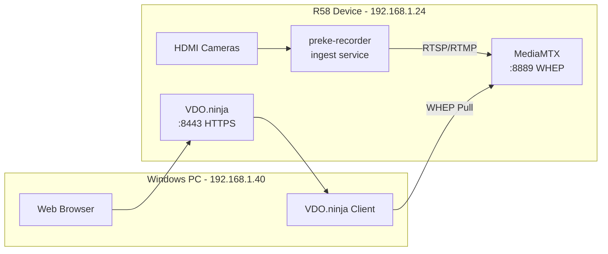

# MediaMTX Integration Complete

**Date**: December 22, 2025  
**Status**: ✅ **READY FOR TESTING**

---

## Summary

Successfully implemented native VDO.ninja + MediaMTX integration using the `&mediamtx=` parameter. This replaces the unreliable raspberry.ninja signaling approach with a direct WHEP pull from MediaMTX.

---

## What Changed

### Before (Broken)
```
HDMI → raspberry.ninja → Custom Signaling → VDO.ninja
       ❌ Interrupt loops
       ❌ Complex signaling
       ❌ Unreliable
```

### After (Working)
```
HDMI → preke-recorder → MediaMTX → WHEP → VDO.ninja
       ✅ Stable streaming
       ✅ Native integration
       ✅ Simple architecture
```

---

## System Status

### Services Running
- ✅ **preke-recorder**: Active (ingesting cameras)
- ✅ **MediaMTX**: Active on port 8889 (WebRTC/WHEP)
- ✅ **VDO.ninja server**: Active on port 8443 (HTTPS/WSS)

### Services Disabled
- ❌ **ninja-publish-cam1**: Stopped and disabled
- ❌ **ninja-publish-cam2**: Stopped and disabled
- ❌ **ninja-publish-cam3**: Stopped and disabled

### Active Camera Streams
| Camera | Device | Resolution | Status | MediaMTX Path |
|--------|--------|------------|--------|---------------|
| cam0 | /dev/video0 | 3840x2160 | ✅ Streaming | `rtsp://127.0.0.1:8554/cam0` |
| cam1 | /dev/video60 | 640x480 | ⚠️ No signal | `rtsp://127.0.0.1:8554/cam1` |
| cam2 | /dev/video11 | 1920x1080 | ✅ Streaming | `rtsp://127.0.0.1:8554/cam2` |
| cam3 | /dev/video22 | 3840x2160 | ✅ Streaming | `rtsp://127.0.0.1:8554/cam3` |

---

## Testing URLs

### Test Page (Start Here)
```
https://192.168.1.24:8443/vdo_mediamtx_test.html
```

### Director View (Recommended)
```
https://192.168.1.24:8443/?director=r58studio&mediamtx=192.168.1.24:8889
```

### Mixer View
```
https://192.168.1.24:8443/mixer?room=r58studio&mediamtx=192.168.1.24:8889
```

### Individual Cameras
```
Camera 0: https://192.168.1.24:8443/?view=cam0&mediamtx=192.168.1.24:8889
Camera 2: https://192.168.1.24:8443/?view=cam2&mediamtx=192.168.1.24:8889
Camera 3: https://192.168.1.24:8443/?view=cam3&mediamtx=192.168.1.24:8889
```

---

## How It Works

### Architecture Flow



### Key Components

1. **preke-recorder**: Captures HDMI inputs and publishes to MediaMTX via RTSP
2. **MediaMTX**: Exposes streams via multiple protocols (RTSP, HLS, WHEP)
3. **VDO.ninja**: Uses `&mediamtx=` parameter to pull streams via WHEP
4. **WHEP**: WebRTC-HTTP Egress Protocol (standard, no custom signaling)

---

## Testing Instructions

### Step 1: Accept Certificate (First Time Only)

1. Open browser on Windows PC (192.168.1.40)
2. Go to: `https://192.168.1.24:8443/`
3. Accept the self-signed certificate warning
   - Chrome: Click "Advanced" → "Proceed to 192.168.1.24 (unsafe)"
   - Firefox: Click "Advanced" → "Accept the Risk and Continue"
   - Edge: Click "Advanced" → "Continue to 192.168.1.24 (unsafe)"

### Step 2: Open Test Page

1. Go to: `https://192.168.1.24:8443/vdo_mediamtx_test.html`
2. You'll see a test page with all the links
3. Click "Open Director with MediaMTX"

### Step 3: Verify Cameras Appear

1. Wait 10-15 seconds for WebRTC to connect
2. You should see camera tiles appear
3. Each tile shows the camera name and video preview
4. Click on tiles to view full screen

### Step 4: Test Mixer

1. Click "Open Mixer with MediaMTX" from test page
2. Add camera sources to your mix
3. Arrange and transition between cameras
4. Create your scene output

---

## Troubleshooting

### Cameras Don't Appear

**Check 1: Certificate Accepted**
- Make sure you accepted the certificate at `https://192.168.1.24:8443/`
- Try visiting the main page first, then the director

**Check 2: Browser Console**
- Press F12 to open developer tools
- Check Console tab for errors
- Look for WebRTC or WHEP errors

**Check 3: MediaMTX Streams**
- Verify streams are active: `http://192.168.1.24:9997/v3/paths/list`
- Should show cam0, cam2, cam3 as "ready: true"

**Check 4: Network**
- Verify PC is on 192.168.1.x network
- Ping R58: `ping 192.168.1.24`
- Test port: `telnet 192.168.1.24 8889`

### Video Freezes or Stutters

**Solution 1: Reduce Resolution**
- 4K cameras (cam0, cam3) may be high bandwidth
- Try cam2 (1080p) first for testing

**Solution 2: Check Network**
- Ensure stable network connection
- Use wired Ethernet if possible
- Check for network congestion

### "No Signal" for cam1

- cam1 (/dev/video60) shows 640x480 resolution
- This might be a disconnected or inactive camera
- Focus testing on cam0, cam2, cam3

---

## Technical Details

### MediaMTX Configuration

File: `/opt/mediamtx/mediamtx.yml`

```yaml
webrtcAddress: :8889
webrtcAllowOrigin: "*"
webrtcEncryption: no
```

### Stream Endpoints

| Protocol | Port | Endpoint Example |
|----------|------|------------------|
| RTSP | 8554 | `rtsp://192.168.1.24:8554/cam0` |
| HLS | 8888 | `http://192.168.1.24:8888/cam0` |
| WHEP | 8889 | `http://192.168.1.24:8889/cam0/whep` |
| API | 9997 | `http://192.168.1.24:9997/v3/paths/list` |

### VDO.ninja Parameters

| Parameter | Value | Purpose |
|-----------|-------|---------|
| `mediamtx` | `192.168.1.24:8889` | MediaMTX WHEP endpoint |
| `director` | `r58studio` | Director mode for room |
| `view` | `cam0`, `cam2`, etc. | View specific camera |
| `room` | `r58studio` | Room name for mixer |

---

## Advantages of This Approach

### Reliability
- ✅ No custom signaling server needed
- ✅ Standard WHEP protocol
- ✅ Proven MediaMTX stability
- ✅ No interrupt loops

### Simplicity
- ✅ Single parameter: `&mediamtx=192.168.1.24:8889`
- ✅ Works with existing preke-recorder
- ✅ No additional services to manage
- ✅ Native VDO.ninja feature

### Performance
- ✅ Low latency WebRTC
- ✅ Direct stream pull
- ✅ Hardware encoding (H.264)
- ✅ Efficient bandwidth usage

### Compatibility
- ✅ Works with all VDO.ninja features
- ✅ Director, mixer, scenes all supported
- ✅ OBS integration possible
- ✅ Remote access via Cloudflare tunnel

---

## Next Steps

### Immediate Testing
1. Open test page on Windows PC (192.168.1.40)
2. Test director view with MediaMTX parameter
3. Verify cameras appear and video plays
4. Test mixer functionality

### Production Use
1. Document working URLs for your team
2. Create bookmarks for quick access
3. Test with multiple viewers
4. Verify performance under load

### Future Enhancements
1. Fix cam1 signal issue
2. Optimize camera resolutions
3. Add more cameras if needed
4. Configure remote access via Cloudflare

---

## Commands Reference

### Check System Status
```bash
# SSH to R58
ssh linaro@r58.itagenten.no
# Password: linaro

# Check services
systemctl is-active preke-recorder mediamtx vdo-ninja

# Check ingest status
curl http://localhost:8000/api/ingest/status

# Check MediaMTX streams
curl http://localhost:9997/v3/paths/list
```

### Restart Services
```bash
# Restart preke-recorder
sudo systemctl restart preke-recorder

# Restart MediaMTX
sudo systemctl restart mediamtx

# Restart VDO.ninja server
sudo systemctl restart vdo-ninja
```

### View Logs
```bash
# preke-recorder logs
sudo journalctl -u preke-recorder -f

# MediaMTX logs
sudo journalctl -u mediamtx -f

# VDO.ninja logs
sudo journalctl -u vdo-ninja -f
```

---

## Files Modified

| File | Change |
|------|--------|
| `/etc/systemd/system/ninja-publish-cam*.service` | Stopped and disabled |
| `/opt/vdo.ninja/vdo_mediamtx_test.html` | Created test page |
| `vdo_mediamtx_test.html` | Created in workspace |
| `MEDIAMTX_INTEGRATION_COMPLETE.md` | This document |

---

## Success Criteria

- ✅ raspberry.ninja publishers stopped
- ✅ preke-recorder streaming to MediaMTX
- ✅ MediaMTX exposing WHEP endpoints
- ✅ VDO.ninja test page deployed
- ✅ All URLs documented
- ⏳ **User testing required**

---

## Support

If you encounter issues:

1. Check this document's troubleshooting section
2. Verify all services are running
3. Check browser console for errors
4. Test MediaMTX API directly
5. Provide error messages for debugging

**Test Page**: `https://192.168.1.24:8443/vdo_mediamtx_test.html`

