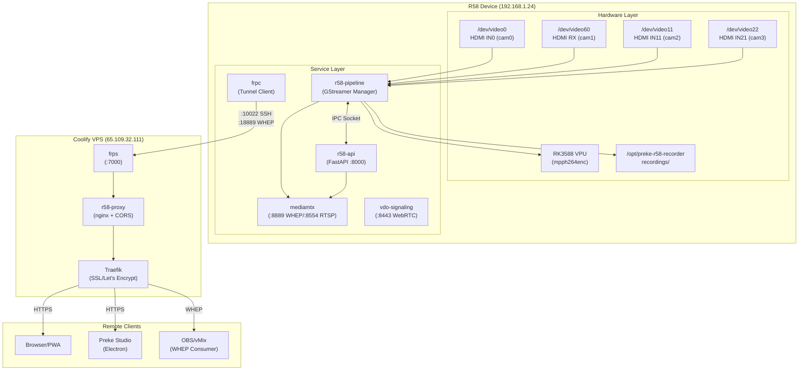
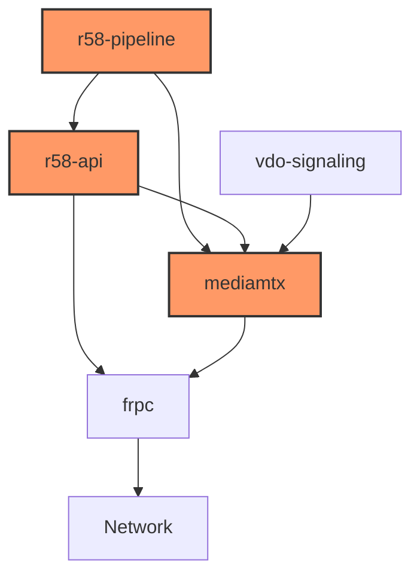

# R58 System Map

> **Version:** 1.0.0  
> **Last Updated:** January 5, 2026  
> **Status:** Production Reference

This document provides a complete inventory of all services, ports, dependencies, and critical paths in the R58 recording system.

---

## Architecture Overview



---

## Service Inventory

### Core Services (Critical)

| Service | Type | Port/Socket | Purpose | Start Command | Health Check | Logs |
|---------|------|-------------|---------|---------------|--------------|------|
| `r58-api` | systemd | TCP :8000 | REST/WebSocket Control API | `sudo systemctl start r58-api` | `curl http://localhost:8000/api/v1/health` | `journalctl -u r58-api -f` |
| `r58-pipeline` | systemd | Unix `/run/r58/pipeline.sock` | GStreamer Pipeline Manager | `sudo systemctl start r58-pipeline` | IPC status command | `journalctl -u r58-pipeline -f` |
| `mediamtx` | systemd | TCP :8889 (WHEP), :8554 (RTSP), :9997 (API) | WebRTC/RTSP Streaming | `sudo systemctl start mediamtx` | `curl http://localhost:9997/v3/paths/list` | `journalctl -u mediamtx -f` |

### Supporting Services

| Service | Type | Port/Socket | Purpose | Start Command | Health Check | Logs |
|---------|------|-------------|---------|---------------|--------------|------|
| `vdo-signaling` | systemd | TCP :8443 (HTTPS) | VDO.ninja WebRTC Signaling | `sudo systemctl start vdo-signaling` | `curl -k https://localhost:8443/` | `journalctl -u vdo-signaling -f` |
| `vdo-webapp` | systemd | TCP :8080 | VDO.ninja Web UI | `sudo systemctl start vdo-webapp` | `curl http://localhost:8080/` | `journalctl -u vdo-webapp -f` |
| `frpc` | systemd | Outbound to VPS :7000 | FRP Tunnel Client | `sudo systemctl start frpc` | Check VPS connectivity | `journalctl -u frpc -f` |

### Legacy Services (Candidates for Removal)

| Service | Type | Port | Purpose | Status | Notes |
|---------|------|------|---------|--------|-------|
| `r58-admin-api` | systemd | TCP :8088 | Mekotronics Legacy Admin | Active (Legacy) | Superseded by r58-api; test removal |

---

## Network Port Matrix

### R58 Device Ports

| Port | Protocol | Service | Direction | Purpose |
|------|----------|---------|-----------|---------|
| 8000 | HTTP/WS | r58-api | Inbound | REST API + WebSocket events |
| 8080 | HTTP | vdo-webapp | Inbound | VDO.ninja web interface |
| 8088 | HTTP | r58-admin-api | Inbound | Legacy admin (remove?) |
| 8443 | HTTPS/WSS | vdo-signaling | Inbound | WebRTC signaling |
| 8554 | RTSP | mediamtx | Inbound | RTSP streams |
| 8888 | HTTP | mediamtx | Inbound | HLS streams |
| 8889 | HTTP | mediamtx | Inbound | WHEP/WHIP WebRTC |
| 9997 | HTTP | mediamtx | Inbound | MediaMTX control API |
| 22 | SSH | sshd | Inbound | Local SSH access |

### VPS Ports (65.109.32.111)

| Port | Protocol | Service | Purpose |
|------|----------|---------|---------|
| 7000 | TCP | frps | FRP control plane |
| 10022 | TCP | FRP tunnel | SSH to R58 |
| 18443 | TCP | FRP tunnel | VDO.ninja signaling |
| 18889 | TCP | FRP tunnel | MediaMTX WHEP |
| 19997 | TCP | FRP tunnel | MediaMTX API |
| 443 | HTTPS | Traefik | Public HTTPS endpoints |

### Public Domains

| Domain | Backend | Purpose |
|--------|---------|---------|
| `r58-api.itagenten.no` | VPS → FRP → R58:8000 | API and static files |
| `r58-mediamtx.itagenten.no` | VPS → FRP → R58:8889 | WHEP streams |
| `r58-vdo.itagenten.no` | VPS → FRP → R58:8443 | VDO.ninja |

---

## Hardware Dependencies

### Video Capture Devices

| Device | V4L2 Path | Subdev | HDMI Port | Format | Notes |
|--------|-----------|--------|-----------|--------|-------|
| cam0 | `/dev/video0` | `/dev/v4l-subdev2` | HDMI IN0 | UYVY | LT6911 7-002b |
| cam1 | `/dev/video60` | N/A (direct) | HDMI RX | NV16 | Direct hdmirx |
| cam2 | `/dev/video11` | `/dev/v4l-subdev7` | HDMI IN11 | UYVY | LT6911 4-002b |
| cam3 | `/dev/video22` | `/dev/v4l-subdev12` | HDMI IN21 | UYVY | LT6911 2-002b |

### Hardware Encoder

| Component | Path | Capability | Notes |
|-----------|------|------------|-------|
| VPU (H.264) | `mpph264enc` | Hardware encode | Works reliably |
| RGA | `/dev/dri/renderD128` | Hardware scale/convert | **DO NOT use for 4K input** - causes kernel oops |

### Storage

| Path | Purpose | Minimum Free |
|------|---------|--------------|
| `/opt/preke-r58-recorder/recordings/` | Recording output | 2GB to start, 1GB critical |
| `/var/lib/r58/` | Database, state files | 100MB |
| `/var/log/` | System logs (journald) | 500MB |

---

## Critical Paths

These are the "must work or product is dead" paths:

### Critical Path 1: Recording

```
HDMI Input → r58-pipeline → VPU encode → Storage
     ↓
  r58-api ← IPC → r58-pipeline (control)
     ↓
  WebSocket → Browser (status updates)
```

**If r58-pipeline fails:** No recording, no preview. System is unusable.

**Health indicators:**
- `GET /api/v1/health` returns `healthy`
- `GET /api/v1/recorder/status` shows correct state
- Bytes written counter increases during recording

### Critical Path 2: Preview (WHEP)

```
r58-pipeline → WHIP → MediaMTX → WHEP → Browser
```

**If MediaMTX fails:** No video preview, but recording continues.

**Health indicators:**
- `curl http://localhost:9997/v3/paths/list` shows active paths
- Browser receives video frames

### Critical Path 3: Remote Access

```
R58:frpc → VPS:frps → VPS:nginx → VPS:traefik → Internet
```

**If FRP fails:** Remote access lost, but local operation continues.

**Health indicators:**
- `curl https://r58-api.itagenten.no/api/v1/health` from internet
- SSH via `./connect-r58-frp.sh`

---

## Configuration Files

| File | Location (R58) | Purpose |
|------|----------------|---------|
| `mediamtx.yml` | `/opt/preke-r58-recorder/mediamtx.yml` | MediaMTX configuration |
| `r58.env` | `/etc/r58/r58.env` | Environment variables |
| `frpc.toml` | `/etc/frp/frpc.toml` | FRP client config |
| `config.yml` | `/opt/preke-r58-recorder/config.yml` | Application config |

---

## Service Dependencies



**Startup Order:**
1. `mediamtx` (no dependencies)
2. `r58-pipeline` (needs video devices)
3. `r58-api` (needs r58-pipeline socket)
4. `vdo-signaling` (optional, for mixer)
5. `frpc` (optional, for remote access)

---

## Quick Reference Commands

### Start All Core Services
```bash
sudo systemctl start mediamtx r58-pipeline r58-api
```

### Check All Services
```bash
sudo systemctl status mediamtx r58-pipeline r58-api frpc
```

### View Combined Logs
```bash
sudo journalctl -u r58-api -u r58-pipeline -u mediamtx -f
```

### Health Check All
```bash
curl -s http://localhost:8000/api/v1/health/detailed | jq
curl -s http://localhost:9997/v3/paths/list | jq
```

### List Video Devices
```bash
v4l2-ctl --list-devices
```

---

## Related Documentation

- [docs/CURRENT_ARCHITECTURE.md](../CURRENT_ARCHITECTURE.md) - Detailed architecture
- [docs/R58_SERVICES.md](../R58_SERVICES.md) - Service documentation
- [docs/HARDENING.md](../HARDENING.md) - Stability improvements
- [docs/ops/debug-runbook.md](debug-runbook.md) - Troubleshooting guide

